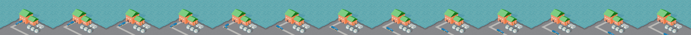

# Atomics
Atomics was a school team project at Tampere University of Applied Sciences. The purpose was to develop a mobile game about nutrient recycling. 
Atomics was part of [Learn about nutrients!](https://www.tuni.fi/en/research/learn-about-nutrients-oras) project
which is funded by the Finnish Ministry of the Environment programme to promote the recycling of nutrients and to improve the ecological status of the Archipelago Sea (RAKI 2).
Learn about nutrients! project was the client to the game.

Atomics was developed with an open-source Java game-development framework, [libGDX](https://libgdx.badlogicgames.com/).

Atomics can be found and installed from [Google Play Store](https://play.google.com/store/apps/details?id=fi.tuni.atomics). The game is free and non-profit.

Happy gaming!

Creators: Me (Teemu Viikeri), [Leevi Kukkula](https://github.com/LeeviKu/) and [Joonas Kirsi](https://github.com/JoonasJalmar/)
